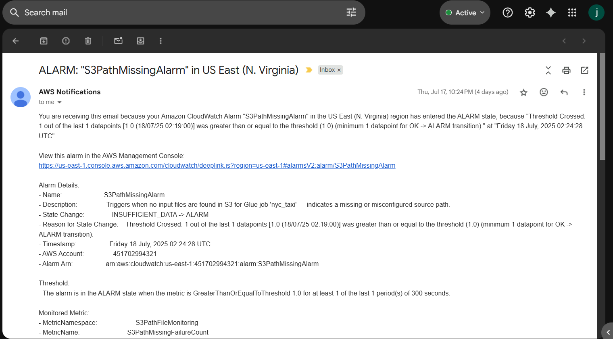

# AWS Serverless Taxi Data Pipeline

## Project Overview

This project implements a fully automated, fault-tolerant data pipeline for NYC taxi data using AWS serverless technologies. The pipeline ingests raw CSV files, processes and transforms the data with AWS Glue, and automatically recovers from failures—ensuring data is processed and loaded reliably with minimal manual intervention.

**Key Highlights:**
- End-to-end automation of data ingestion and ETL using AWS Lambda, Glue, S3, and CloudWatch.
- Fault-tolerant design: The pipeline detects failures in Glue jobs or S3 events and recovers gracefully by triggering retries and sending alerts.
- Modular, extensible architecture ready for further analytics and dashboarding (QuickSight coming soon).

---

## Why is Fault Tolerance Important?

Data pipelines in production often face unpredictable failures—network timeouts, schema changes, data corruption, and AWS service limits can all cause disruptions. Manual recovery is time-consuming and error-prone. A robust, fault-tolerant pipeline:

- **Reduces downtime and data loss**
- **Minimizes manual intervention**
- **Increases pipeline reliability and trust**
- **Ensures business analytics remain up-to-date and actionable**

This design ensures the pipeline can self-heal and alert stakeholders immediately, making it production-grade and business-ready.

---

## Architecture

Click to view architecture details

## Architecture Layers

1. **Trigger Layer:**
   - **EventBridge Scheduler:** Initiates daily pipeline execution.

2. **Orchestration Layer:**
   - **AWS Lambda (`Taxi_data_pipeline`):** Manages the pipeline sequence (Raw Glue Crawler → Glue Job → Processed Glue Crawler).

3. **Processing Layer:**
   - **AWS Glue Crawler (Raw Data):** Detects and catalogs schema from raw data in S3.
   - **AWS Glue Job:** Performs data transformation.
   - **AWS Glue Crawler (Processed Data):** Updates data catalog with schema from processed data.

4. **Monitoring & Notification Layer:**
   - **Amazon CloudWatch Alarm:** Monitors Glue Job for failures.
   - **Amazon SNS:** Sends notifications and triggers retry Lambda upon failure.

5. **Retry & Recovery Layer:**
   - **AWS Lambda (`retry_glue_job_for_exception`):** Automatically retries the Glue Job upon failure notification.

6. **Audit & Alert Layer:**
   - **CloudWatch Logs:** Logs details of retry attempts and outcomes.
   - **Amazon SNS:** Sends final notification indicating success or need for manual intervention.

---

## Features

- **Serverless orchestration** using AWS Lambda and EventBridge
- **Fault detection and recovery** via CloudWatch, Lambda, and SNS
- **Retry logic** with limit to avoid infinite loops
- **CloudWatch Logs** capture all retry attempts (job run ID, reason, timestamp)
- **Automated notifications** for success/failure after retries
- **Modular and easily extendable** for analytics and dashboards

---

## IAM Roles & Permissions (Summary)

Each AWS component in this pipeline requires specific permissions:

|       Components           |                Required Permissions                        |
|----------------------------|------------------------------------------------------------|
| Taxi_data_pipeline_role    | S3 Read/Write, Glue Crawler & Job Control, CloudWatch Logs |
| glue_job_role              | Glue Crawler & Job Control, SNS Publish, CloudWatch Logs   |

> *See [IAM Policies](IAM Policies/) for detailed IAM policy JSON examples.*

---

## Folder Structure

AWS_Taxi_Data_Pipeline/
│
├── README.md
├── Architecture/
│   └── architecture-diagram.png
├── Lambda/
│   ├── Taxi_data_pipeline_lambda.py
│   └── retry_glue_job_for_exception_lambda.py
├── Glue/
│   ├── glue_job_script.py
│   └── glue_crawler_configs/
│       ├── Raw Glue Crawler Config.txt
│       └── Processed Glue Crawler Config.txt
├── Sample Input Raw Data/
│   └── sample_raw_data.parquet
├── Quicksight/
│   └── dashboard_screenshots/
├── docs/
│   └── design_document.md
├── IAM Policies/
│   ├── glue_job_role.json
│   └── Taxi_data_pipeline_role.json
└── .gitignore

---

## How to Run the Pipeline

- Raw data is placed in the S3 bucket (by schedule or upload).
- Lambda function (`Taxi_data_pipeline_lambda.py`) orchestrates: runs raw crawler → Glue job → processed crawler.
- CloudWatch monitors Glue job status.
- On failure, retry Lambda function (`retry_glue_job_for_exception_lambda.py`) is triggered, retries the Glue job once, and sends a single notification about the outcome.

---

## Monitor & Audit

- SNS email alerts for final status after retry (success or failure).
- All retry and job logs are available in CloudWatch Logs.

---

## Fault Tolerance: How It Works

### Automated Failure Detection
- CloudWatch Alarm monitors Glue job status.
- On failure, triggers the retry Lambda.

### Intelligent Retry
- Retry Lambda checks if the job has already been retried.
- If not, retries Glue job once.
- Records retry attempts in CloudWatch Logs (job run ID, reason, timestamp).
- Monitors status of the retried job.
- On final outcome, sends a single SNS notification:
  - **Success:** "Glue job retried and succeeded"
  - **Failure:** "Maximum Lambda retry completed; manual intervention required"

### Single Notification per Failure
- Ensures you get only one notification per Glue job failure (either after retry succeeds or after retry fails).

---

## Error Simulation and Testing

To validate the pipeline's fault tolerance, we manually simulated common failure scenarios:

### Types of Errors Simulated

- **Glue Job Failure:**  
  Intentionally caused a failure in the Glue ETL script by raising an exception (e.g., `raise Exception("Simulated error for testing fault tolerance")`), ensuring the pipeline's retry and alert logic were triggered.

- **S3 Path/File Missing:**  
  Provided a non-existent or incorrect S3 path in the Glue job configuration, causing the job to fail due to missing input files.

- **S3 Data Issues:**  
  Tested with malformed or incompatible data files in the S3 input folder to trigger schema drift or data format errors.

### How We Simulated Errors

- **Glue Script Exception:**  
  Added a `raise Exception(...)` line in the Glue script to force a job failure during transformation.

- **Missing S3 Path/File:**  
  Updated the Glue job or pipeline configuration to reference a folder or file that does not exist in the raw S3 bucket, causing a file-not-found error during job execution.

- **Invalid S3 Data:**  
  Uploaded a file with an unexpected schema or corrupt format to the raw data S3 bucket.

### Results

For each simulated failure, the pipeline:
- Detected the error with CloudWatch Alarms.
- Triggered the retry Lambda function and sent an SNS notification.
- Managed retries as designed, and sent a final alert on success or if manual intervention was required.

**Sample SNS Notifications:**

| Alarm Alert for S3 File Missing | Alarm Alert for Schema Mismatch | Alarm Alert for Exception |
|---------------------------------|---------------------------------|--------------------------|
|  |  |  |

*Above: Actual SNS email notifications for (1) initial Glue job failure, (2) schema mismatch, and (3) retry failure requiring manual intervention.*

| Retry Glue Job Failure Notification | Retry Glue Job Success Notification |
|-------------------------------------|------------------------------------|
|  |  |

*Above: Actual SNS email notifications for failed and successful Glue job recovery events.*

---

## What’s Next

- **QuickSight dashboards and analytics layer to be added soon!**

---

## Tech Stack

- AWS Lambda
- AWS Glue (Jobs & Crawlers)
- Amazon S3
- Amazon CloudWatch
- Amazon SNS
- Amazon EventBridge
- QuickSight
- PySpark
- Python

---

## Contact

Want a walkthrough or have questions?  
Feel free to connect on [LinkedIn](https://www.linkedin.com/in/manasa-goud-j-800589135/) or open an issue in this repo!

